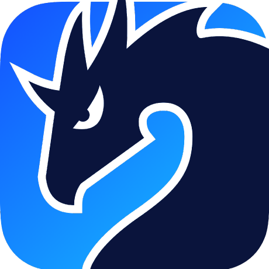

<!-- Animated hero (SMIL). Renders and animates inside ; theme-adaptive via
     the SVG's internal prefers-color-scheme, with a reduced-motion fallback.
     Committed to the repo and served from raw.githubusercontent.com, so it always
     loads with no external card service. -->

<h3 align="center"></h3>

<!-- Annual contribution totals (2020 to present) as a self-hosted SVG,
     regenerated daily by .github/workflows/cumulative.yml from the per-year
     contribution fragment at github.com/users/sepahead/contributions (the
     unauthenticated host, not the rate-limited API). Served from
     raw.githubusercontent.com so it never depends on a third-party card.
     Clicking opens GitHub's native contribution heatmap. -->

<!-- Each weekday's share of contributions over the last 500 days (~16 months) as
     a donut: a week is a cycle, so a ring reads more naturally than bars,
     and shares make the rhythm obvious at a glance. Regenerated daily by
     .github/workflows/weekdays.yml from the same server-rendered fragment. The
     glowing slice marks the peak day. Lives in-repo, so it works regardless of
     external card services. Clicking opens GitHub's native contribution heatmap. -->

<h3 align="center"></h3>

<!-- Self-hosted SVG project cards (generated by scripts/work-cards.mjs): each
     project is its own SVG so each card can be wrapped in a clickable link to
     its repo page. A 2×4 <table> reconstructs the original grid layout
     (cellspacing=20 + 1px transparent SVG padding → 22px gutter, 20px row gap).
     Same visual language as the rest of the profile: rounded card, per-project
     accent spine + wash, status badge (stars / lock), one-liner, stack chips,
     ui-monospace. Theme-adaptive (prefers-color-scheme), reduced-motion safe,
     fully self-contained (no external card services). Served from
     raw.githubusercontent.com. Private repos (engram, prisoma) are linked to
     their repo pages too — they show a lock badge until they go public. -->
<table align="center" cellspacing="20" cellpadding="0" border="0">
  <tr>
    <td></td>
    <td></td>
  </tr>
  <tr>
    <td></td>
    <td></td>
  </tr>
  <tr>
    <td></td>
    <td></td>
  </tr>
  <tr>
    <td></td>
    <td></td>
  </tr>
</table>

<!-- Self-hosted SVG knowledge-graph (generated by scripts/work-graph.mjs) of how
     the projects connect: the always-on NCP protocol links engram (private),
     prisoma (private hub) and crebain; pid-rs, the cobot-* projects and melkor
     connect to prisoma; the cobots and melkor also connect to crebain; cortexel
     connects to engram. The NCP links render as live,
     persistent connections (glow + bi-directional flow). Theme-adaptive,
     reduced-motion safe; served from raw.githubusercontent.com.
     Clicking opens the engram repo — the neural-modeling hub at the centre
     of the graph. -->

<h3 align="center"></h3>

 

<!-- Self-hosted SVG directory-tree of the public repos (generated by
     scripts/repo-tree.mjs): a `tree ~/sep` view with drawn branches and each
     repo's area as a right-aligned note, in the same terminal language as the
     rest of the profile but violet-accented to inherit "Selected work".
     Clicking opens the GitHub profile, where the pinned repos are the
     first content section (GitHub exposes no stable anchor for it). -->

&#8599;&nbsp;&nbsp;<a href="https://github.com/sepahead/brojapid-activationfunctions">brojapid-activationfunctions</a>&nbsp;&middot;&nbsp;<a href="https://github.com/sepahead/mahmoudian-2020-rescience">mahmoudian-2020-rescience</a>&nbsp;&middot;&nbsp;<a href="https://github.com/sepahead/nest-simulator">nest-simulator</a>&nbsp;&middot;&nbsp;<a href="https://github.com/sepahead/relief-atlas">relief-atlas</a>&nbsp;&middot;&nbsp;<a href="https://github.com/sepahead/manwe">manwe</a>&nbsp;&middot;&nbsp;<a href="https://github.com/sepahead/silmaril-vision-studio">silmaril-vision-studio</a>

<h3 align="left"></h3>

 

<table>
<tr><td>

 
&nbsp;&nbsp;&nbsp;
&nbsp;&nbsp;&nbsp;
&nbsp;&nbsp;&nbsp;
&nbsp;&nbsp;&nbsp;
&nbsp;&nbsp;&nbsp;
&nbsp;&nbsp;&nbsp;
&nbsp;&nbsp;&nbsp;

</td></tr>
</table>

<table>
<tr><td>

 
&nbsp;&nbsp;&nbsp;
&nbsp;&nbsp;&nbsp;
&nbsp;&nbsp;&nbsp;
&nbsp;&nbsp;&nbsp;
&nbsp;&nbsp;&nbsp;
&nbsp;&nbsp;&nbsp;
&nbsp;&nbsp;&nbsp;

</td></tr>
</table>

<table>
<tr><td>

 
&nbsp;&nbsp;&nbsp;
&nbsp;&nbsp;&nbsp;
<a href="https://aws.amazon.com/" title="AWS"><picture><source media="(prefers-color-scheme: dark)" srcset="https://raw.githubusercontent.com/sepahead/sepahead/main/pics/aws-white.svg"><source media="(prefers-color-scheme: light)" srcset="https://raw.githubusercontent.com/sepahead/sepahead/main/pics/aws-icon.svg"></picture></a>&nbsp;&nbsp;&nbsp;
&nbsp;&nbsp;&nbsp;
&nbsp;&nbsp;&nbsp;
&nbsp;&nbsp;&nbsp;
&nbsp;&nbsp;&nbsp;

</td></tr>
</table>

<table>
<tr><td>

 
&nbsp;&nbsp;&nbsp;
&nbsp;&nbsp;&nbsp;
&nbsp;&nbsp;&nbsp;
&nbsp;&nbsp;&nbsp;
&nbsp;&nbsp;&nbsp;
&nbsp;&nbsp;&nbsp;

</td></tr>
</table>

<h3 align="center"></h3>

<!-- AGENTIC STACK // MANIFEST panel (generated by scripts/agents.mjs): the agents
     and dev environment in the loop. -->

<h3 align="center"></h3>

<!-- OPEN CHANNEL sign-off (generated by scripts/connect.mjs). The panel is
     wrapped in a real mailto so clicking it opens a compose window; the social
     icons below are live <a> links. -->

&nbsp;&nbsp;&nbsp;
&nbsp;&nbsp;&nbsp;
&nbsp;&nbsp;&nbsp;
&nbsp;&nbsp;&nbsp;
<a href="https://x.com/SepAhead" title="X (Twitter): @SepAhead">
<picture>
<source media="(prefers-color-scheme: dark)" srcset="https://raw.githubusercontent.com/sepahead/sepahead/main/pics/x-logo-white.svg">
<source media="(prefers-color-scheme: light)" srcset="https://raw.githubusercontent.com/sepahead/sepahead/main/pics/x-logo-black.svg">

</picture>
</a>

