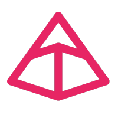
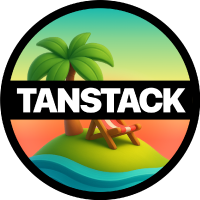
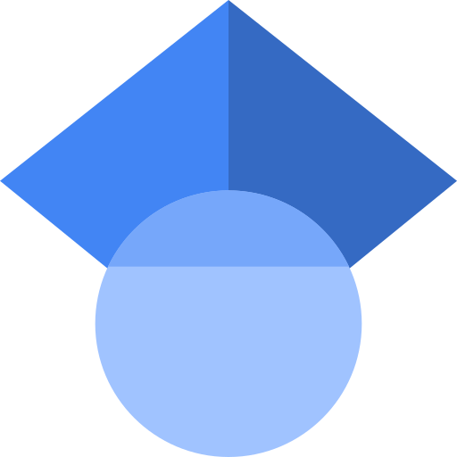

<!-- Animated hero (SMIL). Renders and animates inside ; theme-adaptive via
     the SVG's internal prefers-color-scheme, with a reduced-motion fallback.
     Committed to the repo and served from raw.githubusercontent.com, so it always
     loads with no external card service. -->

---

<h3>The pulse</h3>

<!-- Annual contribution totals (2020 to present) as a self-hosted SVG,
     regenerated daily by .github/workflows/cumulative.yml from the per-year
     contribution fragment at github.com/users/sepahead/contributions (the
     unauthenticated host, not the rate-limited API). Served from
     raw.githubusercontent.com so it never depends on a third-party card. -->

<!-- Each weekday's share of contributions over the last 500 days (~16 months) as
     a donut &mdash; a week is a cycle, so a ring reads more naturally than bars,
     and shares make the rhythm obvious at a glance. Regenerated daily by
     .github/workflows/weekdays.yml from the same server-rendered fragment. The
     glowing slice marks the peak day. Lives in-repo, so it works regardless of
     external card services. -->

---

<h3>Selected work</h3>

<!-- A hand-authored table, deliberately not github-readme-stats pin cards: the
     public card service (github-readme-stats.vercel.app) is rate-limited (~100
     req/hr per IP) and frequently returns 503 / DEPLOYMENT_PAUSED, so this &mdash;
     the highest-stakes section &mdash; would fail hardest as broken images. A
     static table never breaks, matches the self-hosted ethos of the charts
     below, and stays accurate (these star counts are slow-moving). -->

| Project | What it is | Stack |
|---|---|---|
| **[crebain](https://github.com/sepahead/crebain)** &#9733;8 | Adaptive Response &amp; Awareness System (ARAS) &mdash; tactical visualization and autonomy prototype: sensor fusion, ML detection, drone physics, ROS&nbsp;/&nbsp;Gazebo. The flagship. | TS &middot; Rust &middot; Nix |
| **[brojapid-activationfunctions](https://github.com/sepahead/brojapid-activationfunctions)** &#9733;4 | Partial Information Decomposition analysis of activation functions for PID deep neural networks (PIDeepnets). | Python |
| **[cobot-atlas](https://github.com/sepahead/cobot-atlas)** &#9733;2 | 3D mesh-generation pipeline &mdash; 2,023 meshes for robot simulation; dataset published on Hugging&nbsp;Face. | Python |
| **[engram](https://github.com/sepahead/engram)** &#9733;2 | Engram Neural Modeling Labs &mdash; neural-network and neural-modeling experiments. | Python |
| **[pid-rs](https://github.com/sepahead/pid-rs)** &#9733;1 | Partial Information Decomposition with continuous mutual-information (KSG&nbsp;/&nbsp;I&#8339;&#739;) estimators, in safe Rust. | Rust |
| **[NCP](https://github.com/sepahead/NCP)** &#9733;1 | Safety-gated, provenance-first wire protocol (Rust SDK) letting a neural-network simulation perceive and act through robots, UAVs and analysis clients. Pre-1.0. | Rust |

<strong>More repositories</strong>

 

| Repository | Area |
|---|---|
| **[mahmoudian-2020-rescience](https://github.com/sepahead/mahmoudian-2020-rescience)** | ReScience&nbsp;C publication &mdash; three-way information-theoretic analysis of transfer functions (replication, forked by&nbsp;3). |
| **[nest-simulator](https://github.com/sepahead/nest-simulator)** | NEST neural-network simulator &mdash; fork carrying original contributions on feature branches. |
| **[melkor](https://github.com/sepahead/melkor)** | Gaussian splatting pipelines &amp; depth analysis. |
| **[relief-atlas](https://github.com/sepahead/relief-atlas)** | 10K+ AI-generated 3D mesh assets for disaster relief &amp; humanitarian aid. |
| **[manwe](https://github.com/sepahead/manwe)** | Real-time UAV detection from vision, in Rust. |
| **[silmaril-vision-studio](https://github.com/sepahead/silmaril-vision-studio)** | Computer-vision studio &amp; testbed for prototyping vision models. |

Repo names borrow from Tolkien &mdash; <em>crebain</em> were Saruman's spy-crows.

---

<h3>The toolbox</h3>

 

**AI / ML**

&nbsp;&nbsp;
&nbsp;&nbsp;
&nbsp;&nbsp;
&nbsp;&nbsp;
&nbsp;&nbsp;

**Backend &amp; Systems**

&nbsp;&nbsp;
&nbsp;&nbsp;
&nbsp;&nbsp;
&nbsp;&nbsp;

**Cloud &amp; DevOps**

&nbsp;&nbsp;
&nbsp;&nbsp;
<a href="https://aws.amazon.com/" title="AWS"><picture><source media="(prefers-color-scheme: dark)" srcset="https://raw.githubusercontent.com/sepahead/sepahead/main/pics/aws-white.svg"><source media="(prefers-color-scheme: light)" srcset="https://raw.githubusercontent.com/sepahead/sepahead/main/pics/aws-icon.svg"></picture></a>&nbsp;&nbsp;
&nbsp;&nbsp;
&nbsp;&nbsp;

**Frontend &amp; Web**

&nbsp;&nbsp;
&nbsp;&nbsp;
&nbsp;&nbsp;
&nbsp;&nbsp;

---

<h3>Elsewhere</h3>

&nbsp;&nbsp;
&nbsp;&nbsp;
&nbsp;&nbsp;
&nbsp;&nbsp;
<a href="https://x.com/SepehrMN" title="X (Twitter) &mdash; @SepehrMN">
<picture>
<source media="(prefers-color-scheme: dark)" srcset="https://raw.githubusercontent.com/sepahead/sepahead/main/pics/x-logo-white.svg">
<source media="(prefers-color-scheme: light)" srcset="https://raw.githubusercontent.com/sepahead/sepahead/main/pics/x-logo-black.svg">

</picture>
</a>

<strong><a href="mailto:sepehr.mahmoudian@gmail.com">sepehr.mahmoudian@gmail.com</a></strong> &mdash; always open to interesting problems.

